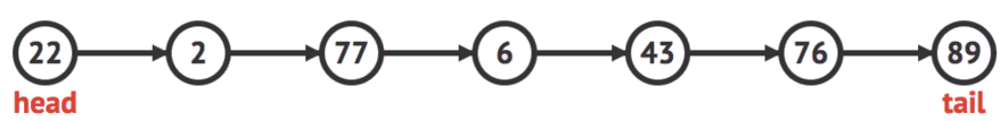

Linked List veri yapısında elemanlar, her eleman kendi değerini ve bir sonraki elemanın adresini tutacak şekilde saklanır. Yapıdaki elemanlar baş elemandan (head) başlanarak son elemana (tail) gidecek şekilde gezilebilir. Diziye karşın avantajı hafızanın dinamik bir şekilde kullanılmasıdır. Bu veri yapısında uygulanabilecek işlemler:

- Veri yapısının sonuna eleman ekleme.
- Anlık veri yapısını baştan (head) sona (tail) gezme.

<figure markdown="span">
{ width="100%" }
<figcaption>Örnek bir Linked List yapısı</figcaption>
</figure>

```c++
// Her bir elemani (burada sayilari, yani int) tutacak struct olusturuyoruz.
struct node {
    int data;
    node *next;
};
node *head, *tail;

void push_back(int x) {
    // Yeni elemanimizi hafizada olusturuyoruz.
    node *t = (node *)malloc(sizeof(node));
    t->data = x;    // Elemanin verisini atiyoruz.
    t->next = NULL; // Sona ekledigimizden sonraki elemanina NULL atiyoruz.

    // Eger veri yapimiza hic eleman eklenmediyse head
    // ve tail elemanlarini olusturuyoruz.
    if (head == NULL && tail == NULL) {
        head = t;
        tail = t;
    }
    // Eklenmisse yeni tail elemanimizi guncelliyoruz.
    else {
        tail->next = t;
        tail = t;
    }
}

void print() {
    // Dizideki tum elemanlari geziyoruz.
    node *t = head;
    while (t != NULL) {
        printf("%d ", t->data);
        t = t->next;
    }
}
```
