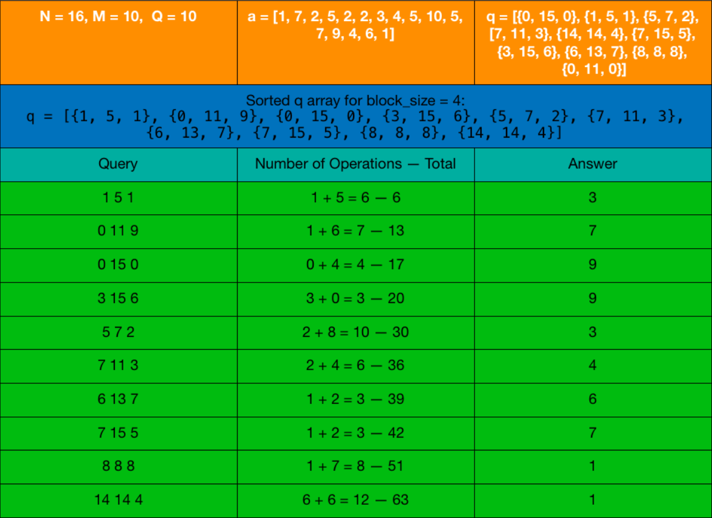

This method will be a key for solving offline range queries on an array. By offline, we mean we can find the answers of these queries in any order we want and there are no updates. Let’s introduce a problem and construct an efficient solution for it.

You have an array a with $N$ elements such that it’s elements ranges from $1$ to $M$. You have to answer $Q$ queries. Each is in the same type. You will be given a range $[l, r]$ for each query, you have to print how many different values are there in the subarray $[a_l , a_{l+1}..a_{r−1}, a_r]$.

First let’s find a naive solution and improve it. Remember the frequency array we mentioned before. We will keep a frequency array that contains only given subarray’s values. Number of values in this frequency array bigger than 0 will be our answer for given query. Then we have to update frequency array for next query. We will use $\mathcal{O}(N)$ time for each query, so total complexity will be $\mathcal{O}(Q \times N)$. Look at the code below for implementation.

```cpp
class Query {
   public:
    int l, r, ind;
    Query(int l, int r, int ind) {
        this->l = l, this->r = r, this->ind = ind;
    }
};

void del(int ind, vector<int> &a, vector<int> &F, int &num) {
    if (F[a[ind]] == 1) num--;
    F[a[ind]]--;
}

void add(int ind, vector<int> &a, vector<int> &F, int &num) {
    if (F[a[ind]] == 0) num++;
    F[a[ind]]++;
}

vector<int> solve(vector<int> &a, vector<Query> &q) {
    int Q = q.size(), N = a.size();
    int M = *max_element(a.begin(), a.end());
    vector<int> F(M + 1, 0);  // This is frequency array we mentioned before
    vector<int> ans(Q, 0);
    int l = 0, r = -1, num = 0;
    for (int i = 0; i < Q; i++) {
        int nl = q[i].l, nr = q[i].r;
        while (l < nl) del(l++, a, F, num);
        while (l > nl) add(--l, a, F, num);
        while (r > nr) del(r--, a, F, num);
        while (r < nr) add(++r, a, F, num);
        ans[q[i].ind] = num;
    }
    return ans;
}
```

Time complexity for each query here is $\mathcal{O}(N)$. So total complexity is $\mathcal{O}(Q \times N)$. Just by changing the order of queries we will reduce this complexity to $\mathcal{O}((Q + N) \times \sqrt N)$.

## Mo's Algorithm

We will change the order of answering the queries such that overall complexity will be reduced drastically. We will use following cmp function to sort our queries and will answer them in this sorted order. Block size here is $\mathcal{O}(\sqrt N)$.

```cpp
bool operator<(Query other) const {
    return make_pair(l / block_size, r) <
        make_pair(other.l / block_size, other.r);
}
```

Why does that work? Let’s examine what we do here first then find the complexity. We divide $l$'s of queries into blocks. Block number of a given $l$ is $l$ blocksize (integer division). We sort the queries first by their block numbers then for same block numbers, we sort them by their $r$'s. Sorting all queries will take $\mathcal{O}(Q \times log{Q})$ time. Let’s look at how many times we will call add and del operations to change current $r$. For the same block $r$'s always increases. So for same block it is $\mathcal{O}(N)$ since it can only increase. Since there are $N$ blocksize blocks in total, it will be $\mathcal{O}(N \times N / \text{block\_size})$ operations in total. For same block, add and del operations that changes $l$ will be called at most $\mathcal{O}(\text{block\_size})$ times for each query, since if block number is same then their $l$'s must differ at most by $\mathcal{O}(\text{block\_size})$. So overall it is $\mathcal{O}(Q \times \text{block\_size})$. Also when consecutive queries has different block numbers we will perform at most $\mathcal{O}(N)$ operations, but notice that there are at most $\mathcal{O}(N \div \text{block\_size})$ such consecutive queries, so it doesn't change the overall time complexity. If we pick $block\_size = \sqrt N$ overall complexity will be $\mathcal{O}((Q + N) \times \sqrt N)$. Full code is given below.

<figure markdown="span" style="width: 64%">

<figcaption>Example for the Algorithm</figcaption>
</figure>

```cpp
int block_size;

class Query {
   public:
    int l, r, ind;
    Query(int l, int r, int ind) {
        this->l = l, this->r = r, this->ind = ind;
    }
    bool operator<(Query other) const {
        return make_pair(l / block_size, r) <
               make_pair(other.l / block_size, other.r);
    }
};

void del(int ind, vector<int> &a, vector<int> &F, int &num) {
    if (F[a[ind]] == 1) num--;
    F[a[ind]]--;
}

void add(int ind, vector<int> &a, vector<int> &F, int &num) {
    if (F[a[ind]] == 0) num++;
    F[a[ind]]++;
}

vector<int> solve(vector<int> &a, vector<Query> &q) {
    int Q = q.size(), N = a.size();
    int M = *max_element(a.begin(), a.end());
    block_size = sqrt(N);
    sort(q.begin(), q.end());
    vector<int> F(M + 1, 0);  // This is frequency array we mentioned before
    vector<int> ans(Q, 0);
    int l = 0, r = -1, num = 0;
    for (int i = 0; i < Q; i++) {
        int nl = q[i].l, nr = q[i].r;
        while (l < nl) del(l++, a, F, num);
        while (l > nl) add(--l, a, F, num);
        while (r > nr) del(r--, a, F, num);
        while (r < nr) add(++r, a, F, num);
        ans[q[i].ind] = num;
    }
    return ans;
}
```
