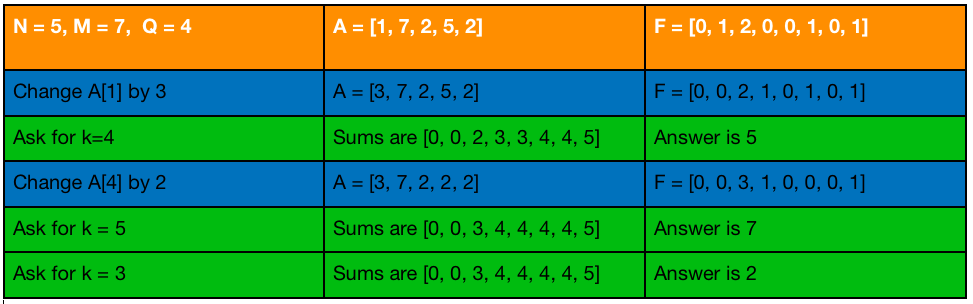
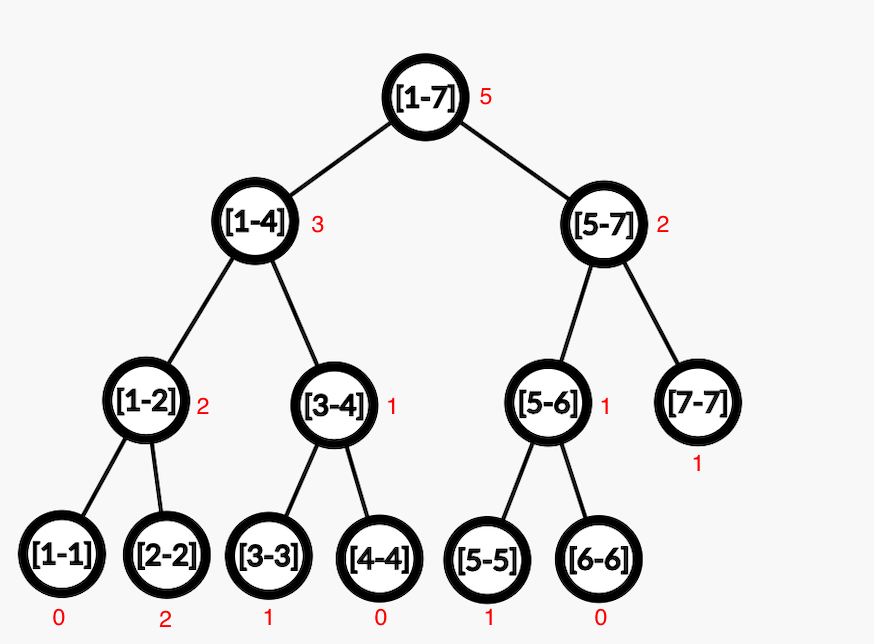
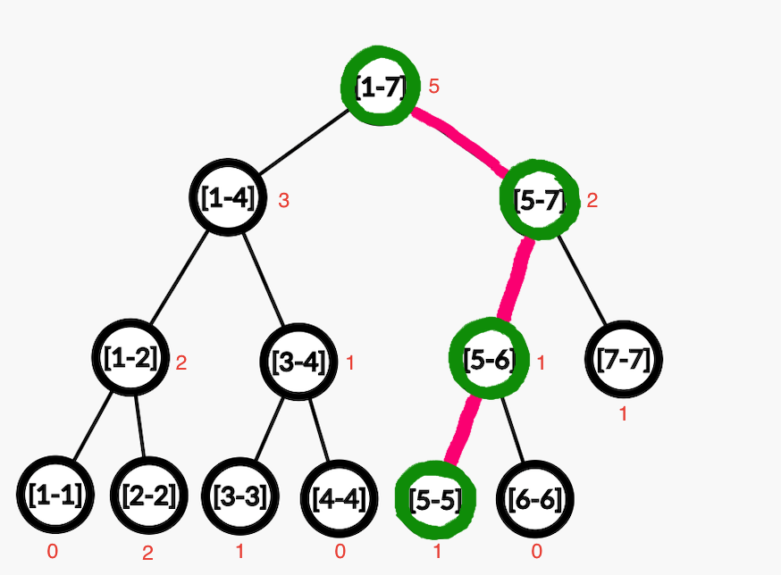

Segment Tree is a data structure that enables us to answer queries like minimum, maximum, sum etc. for any $[l,r]$ interval in $\mathcal{O}(\log N)$ time complexity and update these intervals.

Segment Tree is more useful than [Fenwick Tree](fenwick-tree.md) and [Sparse Table](sparse-table.md) structures because it allows updates on elements and provides the possibility to answer queries like minimum, maximum etc. for any $[l,r]$ interval. Also, the memory complexity of Segment Tree is $\mathcal{O}(N)$ while the memory complexity of the Sparse Table structure is $\mathcal{O}(N \log N)$.

## Structure and Construction
Segment Tree has a "Complete Binary Tree" structure. The leaf nodes of the Segment Tree store the elements of the array, and each internal node's value is calculated with a function that takes its children's values as inputs. Thus, the answers of certain intervals are stored in each node, and the answer of the whole array is stored in the root node. For example, for a Segment Tree structure built for the sum query, the value of each node is equal to the sum of its children's values.

<figure markdown="span">
![segment tree structure to query sum on array a = [41,67,6,30,85,43,39]](img/segtree.png){ width="100%" }
<figcaption>segment tree structure to query sum on array $a = [41,67,6,30,85,43,39]$</figcaption>
</figure>

```c++
void build(int ind, int l, int r) {
    // tree[ind] stores the answer of the interval [l,r]
    if (l == r) {         // leaf node reached
        tree[ind] = a[l]; // store the value of the leaf node
    } else {
        int mid = (l + r) / 2;
        build(ind * 2, l, mid);
        build(ind * 2 + 1, mid + 1, r);
        // the answer of the interval [l,mid] and [mid + 1,r] is the sum of their answers
        tree[ind] = tree[ind * 2] + tree[ind * 2 + 1];
    }
}
```

## Query and Update Algorithms

### Query Algorithm

For any $[l,r]$ interval, the query algorithm works as follows:
- Divide the $[l,r]$ interval into the widest intervals that are stored in the tree.
- Merge the answers of these intervals to calculate the desired answer.

There are at most $2$ intervals that are needed to calculate the answer at each depth of the tree. Therefore, the query algorithm works in $\mathcal{O}(\log N)$ time complexity.

<figure markdown="span">
![on array a = [41,67,6,30,85,43,39] query at $[2,6]$ interval](img/segtreequery.png){ width="100%" }
<figcaption>on array $a = [41,67,6,30,85,43,39]$ query at $[2,6]$ interval</figcaption>
</figure>

On array $a = [41,67,6,30,85,43,39]$, the answer of the $[2,6]$ interval is obtained by merging the answers of the $[2,3]$ and $[4,6]$ intervals. The answer for the sum query is calculated as $36+167=203$.

```c++
// [lw,rw] is the interval we are looking for the answer
// [l,r] is the interval that the current node stores the answer
int query(int ind, int l, int r, int lw, int rw) {
    if (l > rw or r < lw) //current interval does not contain the interval we are looking for
        return 0;
    if (l >= lw and r <= rw) //current interval is completely inside the interval we are looking for
        return tree[ind];

    int mid = (l + r) / 2;

    // recursively calculate the answers of all intervals containing the x index
    return query(ind * 2, l, mid, lw, rw) + query(ind * 2 + 1, mid + 1, r, lw, rw);
}
```

### Update Algorithm

Update the value of every node that contains $x$ indexed element.

It is sufficient to update the values of at most $\log(N)$ nodes from the leaf node containing the $x$ indexed element to the root node. Therefore, the time complexity of updating the value of any element is $\mathcal{O}(\log N)$.

<figure markdown="span">
![the nodes that should be updated when updating the $5^{th}$ index of the array a = [41,67,6,30,85,43,39] are as follows:](img/segtreeupdate.png){ width="100%" }
<figcaption>the nodes that should be updated when updating the $5^{th}$ index of the array $a = [41,67,6,30,85,43,39]$ are as follows:</figcaption>
</figure>


```c++
void update(int ind, int l, int r, int x, int val) {
    if (l > x || r < x) // x index is not in the current interval
        return;
    if (l == x and r == x) {
        tree[ind] = val; // update the value of the leaf node
        return;
    }

    int mid = (l + r) / 2;

    // recursively update the values of all nodes containing the x index
    update(ind * 2, l, mid, x, val);
    update(ind * 2 + 1, mid + 1, r, x, val);
    tree[ind] = tree[ind * 2] + tree[ind * 2 + 1];
}
```

A sample problem related to the Segment Tree data structure can be found [here](https://codeforces.com/gym/100739/problem/A){target="_blank"}.

## Segment Tree with Lazy Propagation
Previously, update function was called to update only a single value in array. Please note that a single value update in array may cause changes in multiple nodes in Segment Tree as there may be many segment tree nodes that have this changed single element in it’s range.

### Lazy Propogation Algorithm
We need a structure that can perform following operations on an array $[1,N]$.

- Add inc to all elements in the given range $[l, r]$.
- Return the sum of all elements in the given range $[l, r]$.

Notice that if update was for single element, we could use the segment tree we have learned before. Trivial structure comes to mind is to use an array and do the operations by traversing and increasing the elements one by one. Both operations would take $\mathcal{O}(L)$ time complexity in this structure where $L$ is the number of elements in the given range.

Let’s use segment tree’s we have learned. Second operation is easy, We can do it in $\mathcal{O}(\log N)$. What about the first operation. Since we can do only single element update in the regular segment tree, we have to update all elements in the given range one by one. Thus we have to perform update operation $L$ times. This works in $\mathcal{O}(L \times \log N)$ for each range update. This looks bad, even worse than just using an array in a lot of cases.

So we need a better structure. People developed a trick called lazy propagation to perform range updates on a structure that can perform single update (This trick can be used in segment trees, treaps, k-d trees ...).

Trick is to be lazy i.e, do work only when needed. Do the updates only when you have to. Using Lazy Propagation we can do range updates in $\mathcal{O}(\log N)$ on standart segment tree. This is definitely fast enough.

### Updates Using Lazy Propogation
Let’s be <i>lazy</i> as told, when we need to update an interval, we will update a node and mark its children that it needs to be updated and update them when needed. For this we need an array $lazy[]$ of the same size as that of segment tree. Initially all the elements of the $lazy[]$ array will be $0$ representing that there is no pending update. If there is non-zero element $lazy[k]$ then this element needs to update node k in the segment tree before making any query operation, then $lazy[2\cdot k]$ and $lazy[2 \cdot k + 1]$ must be also updated correspondingly.

To update an interval we will keep 3 things in mind.

- If current segment tree node has any pending update, then first add that pending update to current node and push the update to it’s children.
- If the interval represented by current node lies completely in the interval to update, then update the current node and update the $lazy[]$ array for children nodes.
- If the interval represented by current node overlaps with the interval to update, then update the nodes as the earlier update function.

```c++
void update(int node, int start, int end, int l, int r, int val) {
    // If there's a pending update on the current node, apply it
    if (lazy[node] != 0) {
        tree[node] += (end - start + 1) * lazy[node]; // Apply the pending update
        // If not a leaf node, propagate the lazy update to the children
        if (start != end) {
            lazy[2 * node] += lazy[node];
            lazy[2 * node + 1] += lazy[node];
        }
        lazy[node] = 0; // Clear the pending update
    }

    // If the current interval [start, end] does not intersect with [l, r], return
    if (start > r || end < l) {
        return;
    }

    // If the current interval [start, end] is completely within [l, r], apply the update
    if (l <= start && end <= r) {
        tree[node] += (end - start + 1) * val; // Update the segment
        // If not a leaf node, propagate the update to the children
        if (start != end) {
            lazy[2 * node] += val;
            lazy[2 * node + 1] += val;
        }
        return;
    }

    // Otherwise, split the interval and update both halves
    int mid = (start + end) / 2;
    update(2 * node, start, mid, l, r, val);
    update(2 * node + 1, mid + 1, end, l, r, val);

    // After updating the children, recalculate the current node's value
    tree[node] = tree[2 * node] + tree[2 * node + 1];
}
```

This is the update function for given problem. Notice that when we arrive a node, all the updates that we postponed that would effect this node will be performed since we are pushing them downwards as we go to this node. Thus this node will keep the exact values when the range updates are done without lazy. So it’s seems like it is working. How about queries?

### Queries Using Lazy Propogation
Since we have changed the update function to postpone the update operation, we will have to change the query function as well. The only change we need to make is to check if there is any pending update operation on that node. If there is a pending update, first update the node and then proceed the same way as the earlier query function. As mentioned in the previous subsection, all the postponed updates that would affect this node will be performed before we reach it. Therefore, the sum value we look for will be correct.

```c++
int query(int node, int start, int end, int l, int r) {
    // If the current interval [start, end] does not intersect with [l, r], return 0
    if (start > r || end < l) {
        return 0;
    }

    // If there's a pending update on the current node, apply it
    if (lazy[node] != 0) {
        tree[node] += (end - start + 1) * lazy[node]; // Apply the pending update
        // If not a leaf node, propagate the lazy update to the children
        if (start != end) {
            lazy[2 * node] += lazy[node];
            lazy[2 * node + 1] += lazy[node];
        }
        lazy[node] = 0; // Clear the pending update
    }

    // If the current interval [start, end] is completely within [l, r], return the value
    if (l <= start && end <= r) {
        return tree[node];
    }

    // Otherwise, split the interval and query both halves
    int mid = (start + end) / 2;
    int p1 = query(2 * node, start, mid, l, r);       // Query the left child
    int p2 = query(2 * node + 1, mid + 1, end, l, r); // Query the right child

    // Combine the results from the left and right child nodes
    return (p1 + p2);
}
```
Notice that the only difference with the regular query function is pushing the lazy values downwards as we traverse. This is a widely used trick applicable to various problems, though not all range problems. You may notice that we leveraged properties of addition here. The associative property of addition allows merging multiple updates in the lazy array without considering their order. This assumption is crucial for lazy propagation. Other necessary properties are left as an exercise to the reader.

## Binary Search on Segment Tree
Assume we have an array A that contains elements between 1 and $M$. We have to perform 2 kinds of operations.

- Change the value of the element in given index i by x.
- Return the value of the kth element on the array when sorted.

### How to Solve It Naively
Let’s construct a frequency array, $F[i]$ will keep how many times number i occurs in our original array. So we want to find smallest $i$ such that $\sum_{j=1}^{i} F[i] \geq k$. Then the number $i$ will be our answer for the query. And for updates we just have to change $F$ array accordingly.

<figure markdown="span">
{ width="100%" }
<figcaption>A naive update example</figcaption>
</figure>

This is the naive algorithm. Update is O(1) and query is O(M).

```c++
void update(int i, int x) {
    F[A[i]]--;
    F[A[i] = x]++;
}

int query(int k) {
    int sum = 0, ans = 0;
    // Iterate through the frequency array F to find the smallest value
    // for which the cumulative frequency is at least k
    for (int i = 1; i <= M; i++) {
        sum += F[i]; // Add the frequency of F[i] to the cumulative sum
        if (sum >= k) {
            return i;
        }
    }
}
```

### How to Solve It With Segment Tree
This is of course, slow. Let’s use segment tree’s to improve it. First we will construct a segment tree on $F$ array. Segment tree will perform single element updates and range sum queries. We will use binary search to find corresponding $i$ for $k^{th}$ element queries.

<figure markdown = "span">
{ width="100%" }
<figcaption>Segment Tree After First Update</figcaption>
</figure>

```cpp
void update(int i, int x) {
    update(1, 1, M, A[i], --F[A[i]]); // Decrement frequency of old value
    A[i] = x;                        // Update A[i] to new value
    update(1, 1, M, A[i], ++F[A[i]]); // Increment frequency of new value
}

int query(int k) {
    int l = 1, r = m; // Initialize binary search range
    while (l < r) {
        int mid = (l + r) / 2; 
        if (query(1, 1, M, 1, mid) < k)
            l = mid + 1; // Move lower bound up
        else
            r = mid; // Move upper bound down
    }
    return l; // Return index where cumulative frequency is at least k
}
```

If you look at the code above you can notice that each update takes $\mathcal{O}(\log M)$ time and each query takes $\mathcal{O}(\log^{2} M)$ time, but we can do better.

### How To Speed Up?
If you look at the segment tree solution on preceding subsection you can see that queries are performed in $\mathcal{O}(\log^{2} M)$ time. We can make is faster, actually we can reduce the time complexity to $\mathcal{O}(\log M)$ which is same with the time complexity for updates. We will do the binary search when we are traversing the segment tree. We first will start from the root and look at its left child’s sum value, if this value is greater than k, this means our answer is somewhere in the left child’s subtree. Otherwise it is somewhere in the right child’s subtree. We will follow a path using this rule until we reach a leaf, then this will be our answer. Since we just traversed $\mathcal{O}(\log M)$ nodes (one node at each level), time complexity will be $\mathcal{O}(\log M)$. Look at the code below for better understanding.

<figure markdown = "span">
{ width="100%" }
<figcaption>Solution of First Query</figcaption>
</figure>

```cpp
void update(int i, int x) {
    update(1, 1, M, A[i], --F[A[i]]); // Decrement frequency of old value
    A[i] = x;                         // Update A[i] to new value
    update(1, 1, M, A[i], ++F[A[i]]); // Increment frequency of new value
}

int query(int node, int start, int end, int k) {
    if (start == end) return start; // Leaf node, return the index
    int mid = (start + end) / 2; 
    if (tree[2 * node] >= k)
        return query(2 * node, start, mid, k); // Search in left child
    return query(2 * node + 1, mid + 1, end, k - tree[2 * node]); // Search in right child
}

int query(int k) {
    return query(1, 1, M, k); // Public interface for querying
}
```
