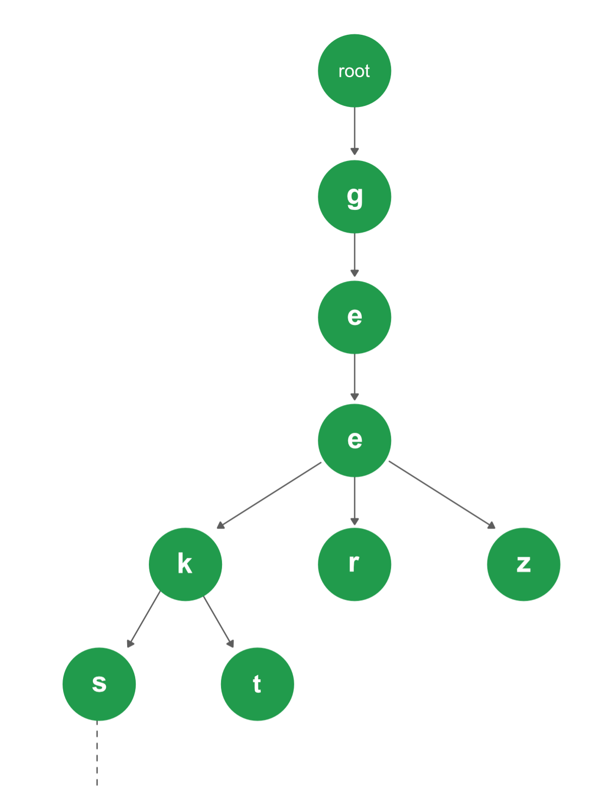

Trie is an efficient information reTrieval data structure. Using Trie, search complexities can be brought to optimal limit (key length). If we store keys in binary search tree, a well balanced BST will need time proportional to $M \times log N$, where $M$ is maximum string length and $N$ is number of keys in tree. Using Trie, we can search the key in $\mathcal{O}(M)$ time. However the penalty is on Trie storage requirements (Please refer [Applications of Trie](https://www.geeksforgeeks.org/advantages-trie-data-structure/) for more details)


<figure markdown="span" style="width: 36%">

<figcaption>Trie Structure. https://www.geeksforgeeks.org/wp-content/uploads/Trie.png</figcaption>
</figure>

Every node of Trie consists of multiple branches. Each branch represents a possible character of keys. We need to mark the last node of every key as end of word node. A Trie node field isEndOfWord is used to distinguish the node as end of word node. A simple structure to represent nodes of English alphabet can be as following,

```cpp
// Trie node
class TrieNode {
   public:
    TrieNode *children[ALPHABET_SIZE];
    bool isEndOfWord;
    TrieNode() {
        isEndOfWord = false;
        for (int i = 0; i < ALPHABET SIZE; i++)
            children[i] = NULL;
    }
};
```

## Insertion

Inserting a key into Trie is simple approach. Every character of input key is inserted as an individual Trie node. Note that the children is an array of pointers (or references) to next level Trie nodes. The key character acts as an index into the array children. If the input key is new or an extension of existing key, we need to construct non-existing nodes of the key, and mark end of word for last node. If the input key is prefix of existing key in Trie, we simply mark the last node of key as end of word. The key length determines Trie depth.

```cpp
void insert(struct TrieNode *root, string key) {
    struct TrieNode *pCrawl = root;
    for (int i = 0; i < key.length(); i++) {
        int index = key[i] - 'a';
        if (!pCrawl->children[index])
            pCrawl->children[index] = new TrieNode;
        pCrawl = pCrawl->children[index];
    }
    pCrawl->isEndOfWord = true;
}
```

## Search

Searching for a key is similar to insert operation, however we only compare the characters and move down. The search can terminate due to end of string or lack of key in Trie. In the former case, if the isEndofWord field of last node is true, then the key exists in Trie. In the second case, the search terminates without examining all the characters of key, since the key is not present in Trie.

```cpp
bool search(struct TrieNode *root, string key) {
    TrieNode *pCrawl = root;
    for (int i = 0; i < key.length(); i++) {
        int index = key[i] - 'a';
        if (!pCrawl->children[index])
            return false;
        pCrawl = pCrawl->children[index];
    }
    return (pCrawl != NULL && pCrawl->isEndOfWord);
}
```

Insert and search costs $\mathcal{O}(\text{key\_length})$. However the memory requirements of Trie high. It is $\mathcal{O}(\text{ALPHABET SIZE} \times \text{key\_length} \times N)$ where $N$ is number of keys in Trie. There are efficient representation of trie nodes (e.g. compressed trie, ternary search tree, etc.) to minimize memory requirements of trie.
