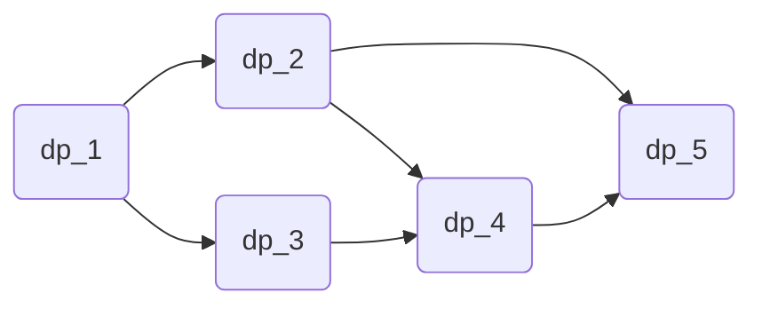

As we know, the nodes of a directed acyclic graph (DAG) can be sorted topologically, and DP can be implemented efficiently using this topological order. 

First, we can find the topological order with a [topological sort](https://en.wikipedia.org/wiki/Topological_sorting) in \( O(N) \) time complexity. Then, we can find the \( dp(V) \) values in topological order, where \( V \) is a node in the DAG and \( dp(V) \) is the answer for node \( V \). The answer and implementation will differ depending on the specific problem.

---

## Converting a DP Problem into a Directed Acyclic Graph

Many DP problems can be converted into a DAG. Let’s explore why this is the case.

While solving a DP problem, when we process a state, we evaluate it by considering all possible previous states. To do this, all of the previous states must be processed before the current state. From this perspective, some states depend on other states, forming a DAG structure.

However, note that some DP problems cannot be converted into a DAG and may require [hyper-graphs](https://en.wikipedia.org/wiki/Hypergraph). (For more details, refer to [**Advanced Dynamic Programming in Semiring and Hypergraph Frameworks**](https://en.wikipedia.org/wiki/Hypergraph)).

### Example Problem:

There are \( N \) stones numbered \( 1, 2, ..., N \). For each \( i \) ( \( 1 \leq i \leq N \) ), the height of the \( i \)-th stone is \( h_i \). There is a frog initially on stone 1. The frog can jump to stone \( i+1 \) or stone \( i+2 \). The cost of a jump from stone \( i \) to stone \( j \) is \( | h_i − h_j | \). Find the minimum possible cost to reach stone \( N \).

### Solution:

We define \( dp[i] \) as the minimum cost to reach the \( i \)-th stone. The answer will be \( dp[N] \). The recurrence relation is defined as:

\[
dp[i] = \min(dp[i−1] + |h_i − h_{i−1}|, dp[i−2] + |h_i − h_{i−2}|)
\]

For \( N = 5 \), we can see that to calculate \( dp[5] \), we need to calculate \( dp[4] \) and \( dp[3] \). Similarly:

- \( dp[4] \) depends on \( dp[3] \) and \( dp[2] \),
- \( dp[3] \) depends on \( dp[2] \) and \( dp[1] \),
- \( dp[2] \) depends on \( dp[1] \).

These dependencies form a DAG, where the nodes represent the stones, and the edges represent the transitions between them based on the jumps.



## DP on Directed Acyclic Graph Problem

Given a DAG with \( N \) nodes and \( M \) weighted edges, find the **longest path** in the DAG.

### Complexity:

The time complexity for this problem is \( O(N + M) \), where \( N \) is the number of nodes and \( M \) is the number of edges.

Solution Code:

```cpp
// topological sort is not written here so we will take tp as it is already sorted
// note that tp is reverse topologically sorted
// vector <int> tp
// n , m and vector <pair<int,int>> adj is given.Pair denotes {node,weight}.
// flag[] denotes whether a node is processed or not.Initially all zero.
// dp[] is DP array.Initially all zero.

for (int i = 0; i < (int)tp.size(); ++i)//processing in order
{
    int curNode = tp[i];

    for (auto v : adj[curNode]) //iterate through all neighbours
        if(flag[v.first]) //if a neighbour is already processed
            dp[curNode] = max(dp[curNode] , dp[v.first] + v.second);

    flag[curNode] = 1;
}
//answer is max(dp[1..n])
```

---

## References

- [NOI IOI training week-5](https://noi.ph/training/weekly/week5.pdf)

- [DP on Graphs MIT](https://courses.csail.mit.edu/6.006/fall11/rec/rec19.pdf)