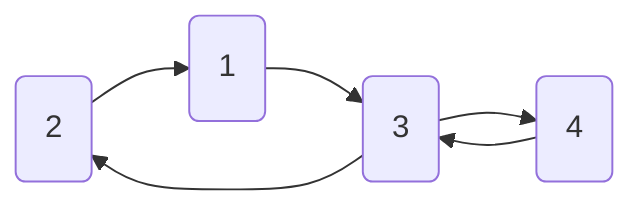
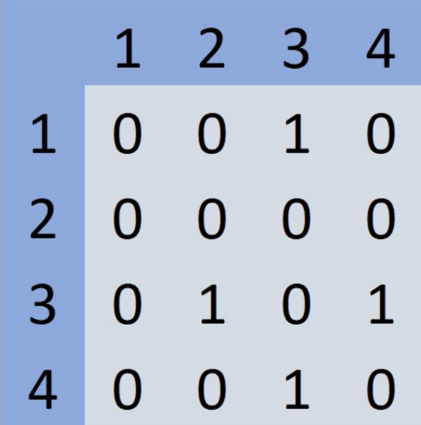

Matrix exponentiation can be used to count the number of walks of a given length on a graph.

Let \( l \) be the desired walk length, and let \( A \) and \( B \) be nodes in a graph \( G \). If \( D \) is the adjacency matrix of \( G \), then \( D^l[A][B] \) represents the number of walks from node \( A \) to node \( B \) with length \( l \), where \( D^k \) denotes the \( k \)-th power of the matrix \( D \).

---

## Explanation:

- **Adjacency Matrix \( D \):**  
  In the adjacency matrix of a graph, each entry \( D[i][j] \) denotes whether there is a direct edge between node \( i \) and node \( j \). Specifically:
  - \( D[i][j] = 1 \) if there is an edge from \( i \) to \( j \),
  - \( D[i][j] = 0 \) otherwise.

- **Matrix Exponentiation:**  
  To find the number of walks of length \( l \) between nodes \( A \) and \( B \), we need to compute \( D^l \), which is the \( l \)-th power of the adjacency matrix \( D \). The entry \( D^l[A][B] \) will then give the number of walks of length \( l \) from node \( A \) to node \( B \).

| { width="50%" } | { width="50%" } |
|:--------------------------------------------------------------------:|:--------------------------------------------------------------------------:|
| D, adjacency matrix of G                                              | D^3, 3rd power of the matrix D                                               |

From the matrix \( D^3 \), we can see that there are 4 total walks of length 3.

Let \( S \) be the set of walks, and let \( w \) be a walk where \( w = \{n_1, n_2, ..., n_k\} \) and \( n_i \) is the \( i \)-th node of the walk. Then:

\[
S = \{\{1, 3, 4, 3\}, \{3, 4, 3, 2\}, \{3, 4, 3, 4\}, \{4, 3, 4, 3\}\}
\]
and \( |S| = 4 \).

Using fast exponentiation on the adjacency matrix, we can efficiently find the number of walks of length \( k \) in \( O(N^3 \log k) \) time, where \( N \) is the number of nodes in the graph.

### Time Complexity Breakdown:
- [**Matrix Multiplication:**](https://en.wikipedia.org/wiki/Matrix_multiplication) The \( O(N^3) \) time complexity comes from multiplying two \( N \times N \) matrices.
- **Fast Exponentiation:** Fast exponentiation reduces the number of multiplications to \( \log k \), resulting in the overall time complexity of \( O(N^3 \log k) \).

This method allows for efficiently calculating the number of walks with any length \( k \) in large graphs.

---

## References

- [Walk Counting on Sciencedirect](https://www.sciencedirect.com/science/article/pii/S0012365X08002008)