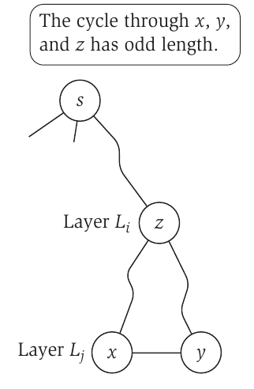

The question is in the title. Is the given graph bipartite? We can use BFS or DFS on graph. Lets first focus on BFS related algorithm. This procedure is very similar to BFS, we have an extra color array and we assign a color to each vertex when we are traversing the graph. Algorithm proof depends on fact that BFS explores the graph level by level. If the graph contains an odd cycle it means that there must be a edge between two vertices that are in same depth (layer, proof can be found on [[1 - Algorithm Design, Kleinberg, Tardos]]()). Let's say the colors are red and black and we traverse the graph with BFS and assign red to odd layers and black to even layers. Then we check the edges to see if there exists an edge that its vertices are same color. If there is a such edge, the graph is not bipartite, else the graph is bipartite.

<figure markdown="span">

<figcaption>If two nodes x and y in the same layer are joined by an edge, then the cycle through x, y, and their lowest common ancestor z has odd length, demonstrating that the graph cannot be bipartite.</figcaption>
</figure>

```cpp
typedef vector<int> adjList;
typedef vector<adjList> graph;
typedef pair<int,int> ii;
enum COLOR {RED, GREEN};
bool bipartite_check(graph &g){
    int root = 0; // Pick 0 indexed node as root.
    vector<bool> visited(g.size(),false);
    vector<int> Color(g.size(),0); 
    queue<ii> Q( { {root,0}} ); // insert root to queue, it is  first layer_0
    visited[root] = true;
    Color[root] = RED;
    while ( !Q.empty() )
    {
        /*top.first is node, top.second its depth i.e layer */
        auto top = Q.front();
        Q.pop();
        for (int u : g[top.first]){
            if ( !visited[u] ){
                visited[u] = true;
                //Mark even layers to red, odd layers to green
                Color[u] = (top.second+1) % 2 == 0 ?  RED : GREEN; 
                Q.push({u, top.second+1 });
            }
        }
    }
    for(int i=0; i < g.size(); ++i){
        for( auto v: g[i]){
            if ( Color[i] == Color[v] ) return false;
        }
    }
    return true;
}
int main(){
    graph g(3);
    g[0].push_back(1);
    g[1].push_back(2);
    g[2].push_back(3);
    cout << (bipartite_check(g) == true ? "YES" : "NO") << endl;
    return 0;
}
```

The complexity of algorithm is is $O(V + E) + O(E) $, BFS and loop over edges. But we can say it  $O(V+E)$ since it is Big-O notation.
