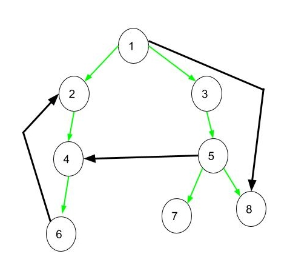
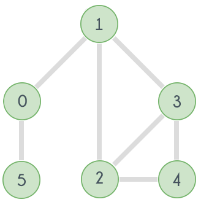

## DFS Order

**DFS order** is traversing all the nodes of a given graph by fixing the root node in the same way as in the DFS algorithm, but without revisiting a discovered node. An important observation here is that the edges and nodes we use will form a **tree** structure. This is because, for every node (**except the root**), we only arrive from another node, and for the **root** node, we do not arrive from any other node, thus forming a **tree** structure.

```cpp
void dfs(int node){
    used[node] = true;
    for(auto it : g[node])
        if(!used[it])
            dfs(it);
}
```

### Types of Edges

When traversing a graph using DFS order, several types of edges can be encountered. These edges will be very helpful in understanding some graph algorithms.

**Types of Edges:**
- **Tree edge:** These are the main edges used while traversing the graph.
- **Forward edge:** These edges lead to a node that has been visited before and is located in our own subtree.
- **Back edge:** These edges lead to nodes that have been visited before but where the DFS process is not yet complete.
- **Cross edge:** These edges lead to nodes that have been visited before and where the DFS process is already complete.

An important observation about these edges is that in an undirected graph, it is impossible to have a cross edge. This is because it is not possible for an edge emerging from a node where the DFS process is complete to remain unvisited.

<figure markdown="span" style="width: 36%">

<figcaption>Green-colored edges are tree edges. Edge (1,8) is a forward edge. Edge (6,4) is a back edge. Edge (5,4) is a cross edge.</figcaption>
</figure>

## Bridge

In an **undirected** and **connected** graph, if removing an edge causes the graph to become disconnected, this edge is called a **bridge**.

### Finding Bridges

Although there are several algorithms to find bridges (such as **Chain Decomposition**), we will focus on **Tarjan's Algorithm**, which is among the easiest to implement and the fastest.

When traversing a graph using DFS, if there is a **back edge** coming out of the subtree of the lower endpoint of an edge, then that edge is **not** a bridge. This is because the **back edge** prevents the separation of the subtree and its ancestors when the edge is removed.

This algorithm is based exactly on this principle, keeping track of the minimum depth reached by the **back edge**s within the subtree of each node.

If the minimum depth reached by the **back edge**s in the subtree of the lower endpoint of an edge is greater than or equal to the depth of the upper endpoint, then this edge is a **bridge**. This is because no **back edge** in the subtree of the edge's lower endpoint reaches a node above the current edge. Therefore, if we remove this edge, the subtree and its ancestors become disconnected.

Using Tarjan's Algorithm, we can find all bridges in a graph with a time complexity of $\mathcal{O}(V + E)$, where $V$ represents the number of vertices and $E$ represents the number of edges in the graph.

```cpp
int dfs(int node, int parent, int depth) {
    int minDepth = depth;
    dep[node] = depth;  // dep dizisi her dugumun derinligini tutmaktadir.
    used[node] = true;
    for (auto it : g[node]) {
        if (it == parent)
            continue;
        if (used[it]) {
            minDepth = min(minDepth, dep[it]);
            // Eger komsu dugum daha once kullanilmis ise
            // Bu edge back edge veya forward edgedir.
            continue;
        }
        int val = dfs(it, node, depth + 1);
        // val degeri alt agacindan yukari cikan minimum derinliktir.
        if (val >= depth + 1)
            bridges.push_back({node, it});
        minDepth = min(minDepth, val);
    }
    return minDepth;
}
```

## Articulation Point

In an undirected graph, if removing a node increases the number of connected components, that node is called an **articulation point** or **cut point**.

<figure markdown="span" style="width: 36%">

<figcaption>For example, if we remove node 0, the remaining nodes are split into two groups: 5 and 1, 2, 3, 4. Similarly, if we remove node 1, the nodes are split into 5, 0 and 2, 3, 4. Therefore, nodes 0 and 1 are **articulation points**.</figcaption>
</figure>

### Finding Articulation Points

Tarjan's Algorithm for finding articulation points in an undirected graph:

- Traverse the graph using DFS order.

- For each node, calculate the depth of the minimum depth node that can be reached from the current node and its subtree through back edges. This value is called the **low** value of the node.

- If the **low** value of any child of a non-root node is greater than or equal to the depth of the current node, then the current node is an **articulation point**. This is because no **back edge** in the subtree of this node can reach a node above the current node. Therefore, if this node is removed, its subtree will become disconnected from its ancestors.

- If the current node is the root (the starting node of the DFS order) and there are multiple branches during the DFS traversal, then the root itself is an **articulation point**. This is because the root has multiple connected subgraphs.

Using Tarjan's Algorithm, we can find all articulation points in a graph with a time complexity of $\mathcal{O}(V + E)$, where $V$ is the number of vertices and $E$ is the number of edges in the graph.

```cpp
int dfs(int node, int parent, int depth) {
    int minDepth = depth, children = 0;
    dep[node] = depth;  // dep array holds depth of each node.
    used[node] = true;
    for (auto it : g[node]) {
        if (it == parent)
            continue;
        if (used[it]) {
            minDepth = min(minDepth, dep[it]);
            continue;
        }
        int val = dfs(it, node, depth + 1);
        if (val >= depth and parent != -1)
            isCutPoint[node] = true;
        minDepth = min(minDepth, val);
        children++;
    }
    // This if represents the root condition that we mentioned above.
    if (parent == -1 and children >= 2)
        isCutPoint[node] = true;
    return minDepth;
}
```
