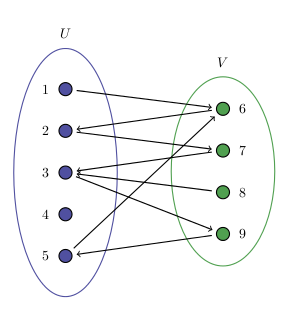

## Definitions of Common Terms

- **Node** - An individual data element of a graph is called Node. Node is also known as vertex.
- **Edge** - An edge is a connecting link between two nodes. It is represented as e = {a,b} Edge is also called Arc.
- **Adjacent** - Two vertices are adjacent if they are connected by an edge.
- **Degree** - a degree of a node is the number of edges incident to the node.
- **Undirected Graphs** - Undirected graphs have edges that do not have a direction. The edges indicate a two-way relationship, in that each edge can be traversed in both directions.
- **Directed Graphs** - Directed graphs have edges with direction. The edges indicate a one-way relationship, in that each edge can only be traversed in a single direction.
- **Weighted Edges** - If each edge of graphs has an association with a real number, this is called its weight.
- **Self-Loop** - It is an edge having the same node for both destination and source point.
- **Multi-Edge** - Some Adjacent nodes may have more than one edge between each other.

## Walks, Trails, Paths, Cycles and Circuits

- **Walk** - A sequence of nodes and edges in a graph.
- **Trail** - A walk without visiting the same edge.
- **Circuit** - A trail that has the same node at the start and end.
- **Path** - A walk without visiting same node.
- **Cycle** - A circuit without visiting same node. 

## Special Graphs

- **Complete Graph** - A graph having at least one edge between every two nodes.
- **Connected Graph** - A graph with paths between every pair of nodes.
- **Tree** - an undirected connected graph that has any two nodes that are connected by exactly one path. There are some other definitions that you can notice it is tree:
    - an undirected graph is connected and has no cycles. an undirected graph is acyclic, and a simple cycle is formed if any edge is added to the graph.
    - an undirected graph is connected, it will become disconnected if any edge is removed.
    - an undirected graph is connected, and has  (number of nodes - 1) edges.

### Bipartite Graphs

A bipartite graph is a graph whose vertices can be divided into two disjoint and independent sets U and V such that every edge connects a vertex in U to one in V. Vertex sets U and V are usually called the parts of the graph. [[1]](https://en.wikipedia.org/wiki/Bipartite\_graph). The figure is shown in below. It is similar to graph coloring with two colors. Coloring graph with two colors is that every vertex have a corresponding color, and for any edge, it's vertices should be different color. In other words, if we can color neighbours two different colors, we can say that graph is bipartite.

<figure markdown="span">

<figcaption>Example bipartite graph, all edges satisfy the coloring constraint</figcaption>
</figure>

We have some observations here.
- A graph 2- colorable if and only if it is bipartite.
- A graph does not contain odd-length cycle if and only if it is bipartite.
- Every tree is a bipartite graph since trees do not contain any cycles.

### Directed Acyclic Graphs

A directed acyclic graph(DAG) is a finite directed graph with no directed cycles. Equivalently, a DAG is a directed graph that has a topological ordering (we cover it in this bundle), a sequence of the vertices such that every edge is directed from earlier to later in the sequence [[2]](https://en.wikipedia.org/wiki/Directed_acyclic_graph). DAGs can be used to encode precedence relations or dependencies in a natural way [[3 - Algorithm Design, Kleinberg, Tardos]](). There are several applications using topological ordering directly such as finding  critical path or automatic differentiation on computational graphs (this is extremely useful for deep learning frameworks [[4]](https://pytorch.org/docs/stable/autograd.html)).

<figure markdown="span">

<figcaption>Example Directed Acyclic Graphs</figcaption>
</figure>

<figure markdown="span" style="width: 64%">

<figcaption>Example computational graph also a DAG, partial derivatives are written to edges respect to topological order</figcaption>
</figure>
