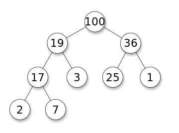
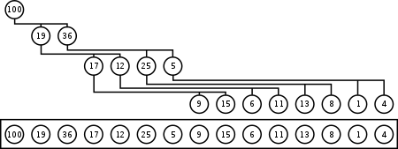
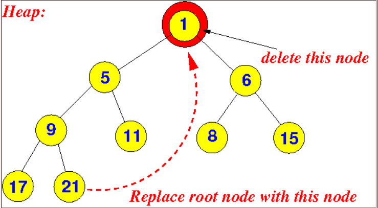
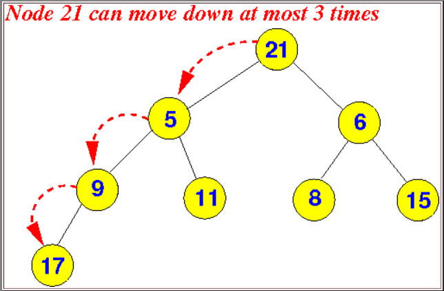

<figure markdown="span">

<figcaption>an example max-heap with 9 nodes</figcaption>
</figure>

The heap is a complete binary tree with N nodes, the value of all the nodes in the left and right sub-tree of the root node should be smaller than the root node's value.

In a heap, the highest (or lowest) priority element is always stored at the root. A heap is not a sorted structure and can be regarded as partially ordered. As visible from the heap-diagram, there is no particular relationship among nodes on any given level, even among the siblings. Because a heap is a complete binary tree, it has a smallest possible height. A heap with $N$ nodes has $logN$ height. A heap is a useful data structure when you need to remove the object with the highest (or lowest) priority.

## Implementation

Heaps are usually implemented in an array (fixed size or dynamic array), and do not require pointers between elements. After an element is inserted into or deleted from a heap, the heap property may be violated and the heap must be balanced by internal operations.

The first (or last) element will contain the root. The next two elements of the array contain its children. The next four contain the four children of the two child nodes, etc. Thus the children of the node at position n would be at positions $2*n$ and $2*n + 1$ in a one-based array. This allows moving up or down the tree by doing simple index computations. Balancing a heap is done by sift-up or sift-down operations (swapping elements which are out of order). So we can build a heap from an array without requiring extra memory.

<figure markdown="span">

<figcaption>example a heap as an array</figcaption>
</figure>

## Insertion

Basically add the new element at the end of the heap. Then look it's parent if it is smaller or bigger depends on the whether it is max-heap or min-heap (max-heap called when Parents are always greater), swap with the parent. If it is swapped do the same operation for the parent.

## Deletion

If you are going to delete a node (root node or another one does not matter),

1. Swap the node to be deleted with the last element of heap to maintain a balanced structure.
2. Delete the last element which is the node we want to delete at the start.
3. Now you have a node which is in the wrong place, You have to find the correct place for the swapped last element, to do this starting point you should check its left and right children, if one them is greater than our node you should swap it with the greatest child(or smallest if it is min-heap).
4. Still current node may in the wrong place, so apply Step 3 as long as it is not greater than its children(or smaller if it is min-heap).

<figure markdown="span" style="width: 40%;">


<figcaption>an example deletion on a heap structure</figcaption>
</figure>

```py
class BinHeap:
    def __init__(self):
        self.heapList = [0]
        self.currentSize = 0

    def percUp(self,i):
        while i // 2 > 0:
            if self.heapList[i] < self.heapList[i // 2]:
                tmp = self.heapList[i // 2]
                self.heapList[i // 2] = self.heapList[i]
                self.heapList[i] = tmp
            i = i // 2

    def insert(self,k):
        self.heapList.append(k)
        self.currentSize = self.currentSize + 1
        self.percUp(self.currentSize)

    def percDown(self,i):
        while (i * 2) <= self.currentSize:
            mc = self.minChild(i)
            if self.heapList[i] > self.heapList[mc]:
                tmp = self.heapList[i]
                self.heapList[i] = self.heapList[mc]
                self.heapList[mc] = tmp
            i = mc

    def minChild(self,i):
        if i * 2 + 1 > self.currentSize:
            return i * 2
        else:
            if self.heapList[i*2] < self.heapList[i*2+1]:
                return i * 2
            else:
                return i * 2 + 1

    def delMin(self):
        retval = self.heapList[1]
        self.heapList[1] = self.heapList[self.currentSize]
        self.currentSize = self.currentSize - 1
        self.heapList.pop()
        self.percDown(1)
        return retval

    def buildHeap(self,alist):
        i = len(alist) // 2
        self.currentSize = len(alist)
        self.heapList = [0] + alist[:]
        while (i > 0):
            self.percDown(i)
            i = i - 1

bh = BinHeap()
bh.buildHeap([9,5,6,2,3])

print(bh.delMin())
print(bh.delMin())
print(bh.delMin())
print(bh.delMin())
print(bh.delMin())
```

## Complexity

Insertion $\mathcal{O}(logN)$, delete-min $\mathcal{O}(logN)$ , and finding minimum $\mathcal{O}(1)$. These operations depend on heap's height and heaps are always complete binary trees, basically the height is $logN$. (N is number of Node)

## Priority Queue
Priority queues are a type of container adaptors, specifically designed so that its first element is always the greatest of the elements it contains, according to some strict weak ordering criterion.

While priority queues are often implemented with heaps, they are conceptually distinct from heaps. A priority queue is an abstract concept like "a list" or "a map"; just as a list can be implemented with a linked list or an array, a priority queue can be implemented with a heap or a variety of other methods such as an unordered array.

```cpp
#include <iostream>       // std::cout
#include <queue>          // std::priority_queue
using namespace std;
int main () {
    priority_queue<int> mypq;

    mypq.push(30);
    mypq.push(100);
    mypq.push(25);
    mypq.push(40);

    cout << "Popping out elements...";
    while (!mypq.empty()) {
        cout << ' ' << mypq.top();
        mypq.pop();
    }
    return 0;
}
```
