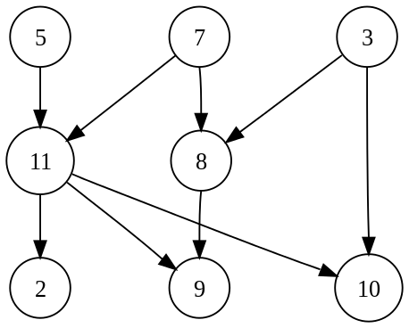

A graph is a structure amounting to a set of objects in which some pairs of the objects are in some sense "related". The objects correspond to the mathematical abstractions called vertices (also called nodes or points) and each of the related pairs of vertices is called an edge. Typically, a graph is depicted in diagrammatic form as a set of dots for the vertices, joined by lines for the edges. [8]

Why graphs? Graphs are usually used to represent different elements that are somehow related to each other.

A Graph consists of a finite set of vertices(or nodes) and set of edges which connect a pair of nodes. G = (V,E)

V = set of nodes

E = set of edges(e) represented as e = a,b

Graph are used to show a relation between objects. So, some graphs may have directional edges (e.g. people and their love relationships that are not mutual: Alice may love Alex, while Alex is not in love with her and so on), and some graphs may have weighted edges (e.g. people and their relationship in the instance of a debt)

<figure markdown="span">

<figcaption>Figure 1: a simple unweigted graph</figcaption>
</figure>