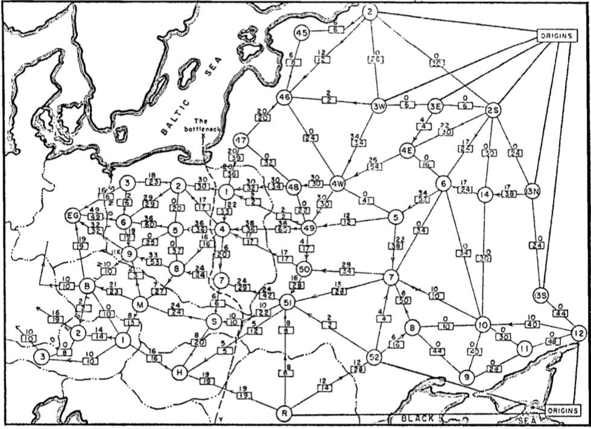
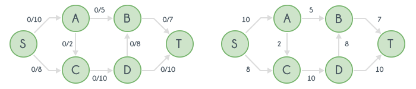
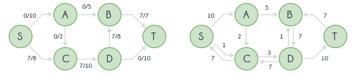
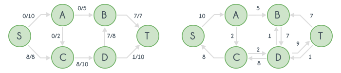
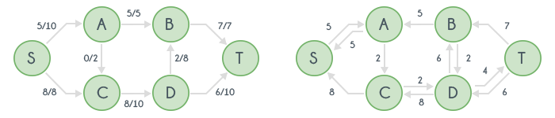
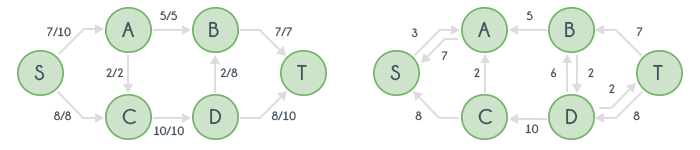

## Flow Network

A flow network is a special type of directed graph that contains a single source and a single target node. In a flow network, each edge has a capacity, which indicates the maximum amount of flow that can pass through that edge.

<figure markdown="span" style="width: 36%">

<figcaption>One of the earliest examples of a flow network in history.</figcaption>
</figure>

## Maximum Flow

Maximum flow is an algorithm that calculates the maximum amount of flow that can reach the target from the source in a flow network while maintaining a continuous flow.

There are several algorithms to solve the Maximum Flow problem. The time complexities of some popular ones are:

- Ford-Fulkerson algorithm: $\mathcal{O}(E * \text{flowCount})$
- Edmonds-Karp algorithm: $\mathcal{O}(V * E^2)$
- Dinic's algorithm: $\mathcal{O}(E * V^2)$

Where V is the number of vertices and E is the number of edges in the flow network.

## Ford Fulkerson

The steps of the Ford-Fulkerson maximum flow algorithm are as follows:

- Find a path from the source to the target.
- The edge with the minimum capacity in the found path determines the flow that can pass through this path.
- Decrease the capacities of the edges in the path by the flow amount (the minimum capacity found in step 2) and add the reverse edges to the graph with a capacity equal to the flow.
- Repeat until there are no more paths from the source to the target.

Why does this algorithm work?

For example, let's assume we find a flow of size x through an edge from u to v.

Suppose the path we found is $a \rightarrow ... \rightarrow u \rightarrow v \rightarrow ... \rightarrow b$.

We will add a new edge from v to u with a capacity of x to our graph, but this newly added reverse edge does not exist in the original graph.

After adding the reverse edges, the new path we find might look like $c \rightarrow ... \rightarrow v \rightarrow u \rightarrow ... \rightarrow d$, with a flow of size y.

It is clear that $y \leq x$.

We can represent three different valid flows as follows:

- A flow of size y following the path $a \rightarrow ... \rightarrow u \rightarrow ... \rightarrow d$
- A flow of size y following the path $c \rightarrow ... \rightarrow u \rightarrow ... \rightarrow b$
- A flow of size x - y following the path $a \rightarrow ... \rightarrow u \rightarrow v \rightarrow ... \rightarrow d$

The overall time complexity of the Ford-Fulkerson algorithm is $\mathcal{O}(E * \text{flowCount})$ because, in the worst case, each found path increases the flow by only 1. Since finding each path takes time proportional to the number of edges, the complexity becomes $\mathcal{O}(E * \text{flowCount})$.

However, if we implement the Ford-Fulkerson algorithm using BFS, the complexity changes. In this case, for every edge, the flows that consider this edge as the bottleneck will continually increase, leading to a time complexity of $\mathcal{O}(V * E^2)$. This specific implementation is known as the Edmonds-Karp Algorithm.

<figure markdown="span" style="width: 72%">

<figcaption>The figure on the left shows how much flow is passing through each edge. The figure on the right represents the current state of the graph.</figcaption>
</figure>

<figure markdown="span" style="width: 72%">

<figcaption>Flow = 7</figcaption>
</figure>

<figure markdown="span" style="width: 72%">

<figcaption>Flow = 8</figcaption>
</figure>

<figure markdown="span" style="width: 72%">

<figcaption>Flow = 13</figcaption>
</figure>

<figure markdown="span" style="width: 72%">

<figcaption>Flow = 15</figcaption>
</figure>

```cpp
// c matrix holds the capacities of the edges.
// g adjacency list allows us to traverse the graph.
bool bfs() {
    vector<bool> visited(n, false);
    queue<int> q;
    q.push(source);
    visited[source] = true;
    while (!q.empty()) {
        int node = q.front();
        q.pop();
        if (node == sink)
            break;
        for (int i = 0; i < g[node].size(); i++) {
            int child = g[node][i];
            if (c[node][child] <= 0 or visited[child])
                continue;
            visited[child] = true;
            parent[child] = node;
            q.push(child);
        }
    }
    return visited[sink];
}
int max_flow() {
    while (bfs()) {
        int curFlow = -1, node = sink;
        while (node != source) {
            // curFlow is the minimum capacity in the current path, i.e. the flow we found.
            int len = c[parent[node]][node];
            if (curFlow == -1)
                curFlow = len;
            else
                curFlow = min(curFlow, len);
            node = parent[node];
        }
        flow += curFlow;
        node = sink;
        while (node != source) {
            c[parent[node]][node] -= curFlow;
            // We are subtracting the flow we found from the path we found.
            c[node][parent[node]] += curFlow;  // We are adding the reverses of the edges
            node = parent[node];
        }
    }
    return flow;
}
```
