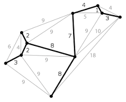
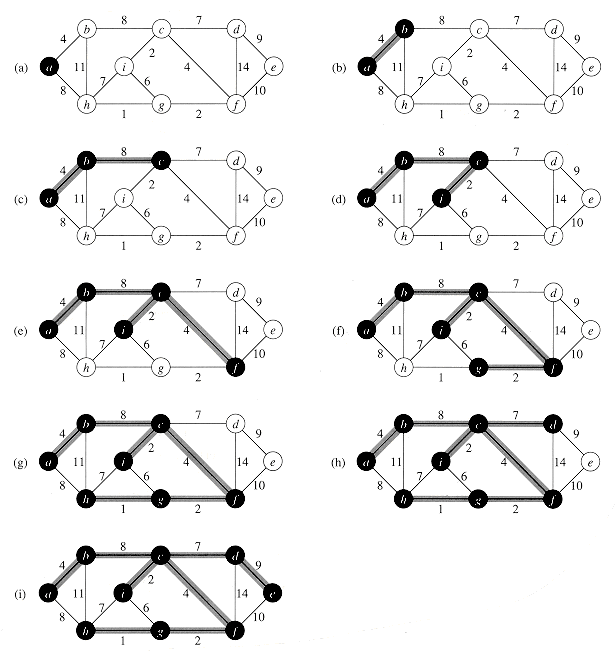
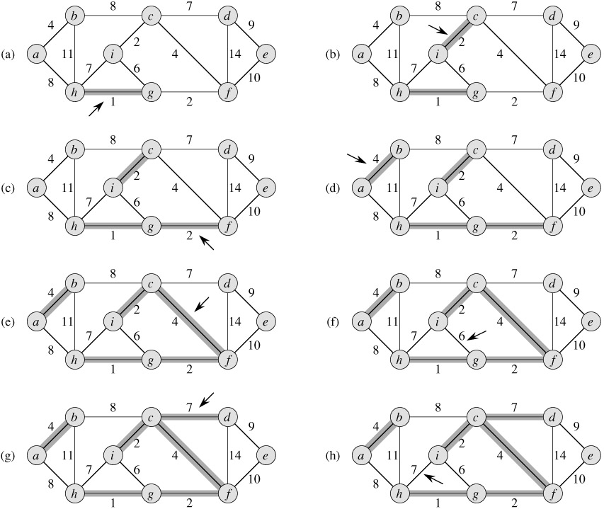

## Definition

Given an undirected weighted connected graph $G = (V,E)$ Spanning tree of G is a connected acyclic sub graph that covers all nodes and some edges. In a disconnected graph -where there is more than one connected component- the spanning tree of that graph is defined as the forest of the spanning trees of each connected component of the graph.

Minimum spanning tree (MST) is a spanning tree in which the sum of edge weights is minimum. The MST of a graph is not unique in general, there might be more than one spanning tree with the same minimum cost. For example, take a graph where all edges have the same weight, then any spanning tree would be a minimum spanning tree. In problems involving minimum spanning trees where you have to output the tree itself (and not just the minimum cost), it either puts more constraint so the answer is unique, or simply asks for any minimum spanning tree.

<figure markdown="span">

<figcaption>MST of the graph. It spans all nodes of the graph and it is connected.</figcaption>
</figure>

To find the minimum spanning tree of a graph, we will introduce two algorithms. The first one called Prim's algorithm, which is similar to Dijkstra's algorithm. Another algorithm is  Kruskal agorithm, which makes use of the disjoint set data structure. Let's discover each one of them in detail!

## Prim Algorithm

Prim algorithm is very similar to Dijkstra's shortest path algorithm. In this algorithm we have a set $S$ which represents the explored nodes and again we can maintain a priority queue data structure the closest node in $V-S$. It is a greedy algorithm just like Dijkstra's shortest path algorithm.

<figure markdown="span" style="text-align: left">
```
G = (V, E)   V set of all nodes, E set of all edges
T = {}       result, edges of MST
S = {1}      explored nodes
while S /= V do
    let (u, v) be the lowest cost edge such that u in S and v in V - S;
    T = T U {(u, v)}
    S = S U {v}
end
```
<figcaption>Prim Algorithm in Pseudo code, what is the problem here?</figcaption>
</figure>

There is a problem with this implementation, it assumes that the graph is connected. If the graph is not connected this algorithm will be stuck on loop. There is a good visualization for Prim algorithm at [10]. If we use priority queue complexity would be $O(ElogV)$.

<figure markdown="span">

<figcaption>Example of how Prim Algorithm constructs the MST</figcaption>
</figure>

## Kruskal Algorithm

In Prim algorithm we started with a specific node and then proceeded with choosing the closest neighbor node to our current graph. In Kruskal algorithm, we follow a different strategy; we start building our MST by choosing one edge at a time, and link our (intially separated) nodes together until we connect all of the graph.

To achieve this task, we will start with having all the nodes separated each in a group. In addition, we will have the list of edges from the original graph sorted based on their cost. At each step, we will:

1. Pick the smallest available edge (that is not taken yet)
2. Link the nodes it connects together, by merging their group into one unified group
3. Add the cost of the edge to our answer

However, you may realize in some cases the link we add will connect two nodes from the same group (because they were grouped before by other taken edges), hence violating the spanning tree condition (Acyclic) and more importantly introducing unnecessary edges that adds more cost to the answer. So to solve this problem, we will only add the edges as long as they connect two currently (at the time of processing this edge) separated nodes that belong to different groups, hence completing the algorithm.

The optimality of Kruskal algorithm comes from the fact that we are taking from a sorted list of edges. For more rigorous proof please refer to [11].

So how can we effectively merge the group of nodes and check that which group each node belong? We can utilize disjoint set data structure which will help us to make union and find operations in an amortized constant $\mathcal{O}(1)$ time.

```cpp
typedef pair<int,pair<int,int>> edge;
// represent edge as triplet (w,u,v)
// w is weigth, u and v verticies.
// edge.first is weigth edge.second.first -> u, edge.second.second -> v
typedef vector<edge> weigthed_graph;

/*union - find data structure utilities */
const int maxN = 3005;
int parent[maxN];
int ssize[maxN];
void make_set(int v);
int find_set(int v);
void union_sets(int a, int b);
void init_union_find();

/*Code that finds edges in MST */
void kruskal(vector<edge> &edgeList ){
    vector<edge> mst;
    init_union_find();
    sort(edgeList.begin(),edgeList.end(), \
        [](const auto &a, const auto  &b) { return a.first< b.first;}); 
    //well this weird syntax is lambda function 
    // for sorting pairs to respect their first element.
    for( auto e: edgeList){
        if( find_set(e.second.first )!= find_set(e.second.second)){
            mst.push_back(e);
            union_sets(e.second.first, e.second.second);
        }
    }
}
```

To calculate the time complexity, observe how we first sorted the edges, this takes $\mathcal{O}(E log E)$. In addition we pass through the edges one by one, and each time we check which group the two nodes of the edge belongs to, and in some cases merge the two groups. So in the worst case we will assume that both operations (finding and merging) happens, but since the disjoint data structure guarantee $\mathcal{O}(1)$ amortized time for both operations, we end up with $\mathcal{O}(E)$ amortized time of processing the nodes.

So in total we have $\mathcal{O}(E log E)$ from sorting edges and $\mathcal{O}(E)$ from processing them, those results in a total of $\mathcal{O}(E log E)$ (if you don't understand why please refer to the first bundle where we discuss time complexity).

<figure markdown="span">

<figcaption>Example of how Kruskal Algorithm constructs the MST</figcaption>
</figure>
