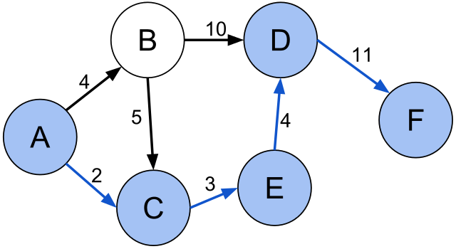

## Definition

Let \(G(V,E)\) be a graph, \(v_i\) and \(v_j\) be two nodes of \(G\). We say a path between \(v_i\) and \(v_j\) is the shortest path if sum of the edge weights (cost) in the path is minimum. In other words, the shortest path problem is the problem of finding a path between two vertices (or nodes) in a graph such that the sum of the weights of its constituent edges is minimized. [5]

<figure markdown="span">

<figcaption>Example shortest path in graph. Source is A and target is F. Image taken from [5].</figcaption>
</figure>

We will cover several shortest path algorithms in this bundle. One of them is Dijkstra’s Shortest Path Algorithm but it has some drawbacks: Edge weights should be non-negative for the optimally of the algorithm. We will discover other algorithms in which these condition isn’t necessary, like Floyd-Warshall and Bellman-Ford algorithms.

## Dijkstra's Shortest Path Algorithm

Dijkstra’s Shortest Path algorithm is straight forward. In brief we have a set \(S\) that contains explored nodes and \(d\) which contains the shortest path cost from source to another node. In other words, \(d(u)\) represents the shortest path cost from source to node \(u\). The procedure follows as that. First, add source node to set \(S\) which represents the explored nodes and assigns the minimum cost of the source to zero. Then each iteration we add node to \(S\) that has lowest cost \((d(u))\) from unexplored nodes. Let’s say \(S′ = V − S\) which means unexplored nodes. For all nodes in \(S′\) we calculate \(d(x)\) for each node \(x\) is \(S′\) then we pick minimum cost node and add it to \(S\). So how we calculate \(d(x)\)? For any \(x\) node from \(S′\), \(d(x)\) calculated as that, let’s say \(e\) cost of any edge from \(S\) to \(x\) then \(d(x) = min(d(u) + e)\). It is a greedy algorithm.

Here is the explanation of the algorithm step by step.

1. Initialize an empty set, distance array, insert source to set.

2. Initialize a min-heap, put source to heap with key is zero.

3. While heap is not empty, take the top element from heap and add its neighbours to min-heap.

4. Once we pick an element from the heap, it is guaranteed that the same node will never be added to heap with lower key value.

In implementation we can use priority queue data structure in order to increase efficiency. If we put unexplored nodes to min - priority queue where the distance is key, we can take the lowest cost unexplored node in \(O(log(n))\) time which is efficient.

```cpp
typedef pair<int,int> edge;
typedef vector<edge> adjList;
typedef vector<adjList> graph;

void dijkstra(graph &g, int s) {
    vector<int> dist(g.size(),INT_MAX/2);
    vector<bool> visited(g.size(),false);

    dist[s] = 0;

    priority_queue<edge, vector<edge>, greater<edge>> q;
    q.push({0, s});

    while(!q.empty()) {
        int v = q.top().second;
        int d = q.top().first;
        q.pop();

        if(visited[v]) continue;
        visited[v] = true;

        for(auto it: g[v]) {
            int u = it.first;
            int w = it.second;
            if(dist[v] + w < dist[u]) {
                dist[u] = dist[v] + w;
                q.push({dist[u], u});
            } 
        }       
    }
}
```