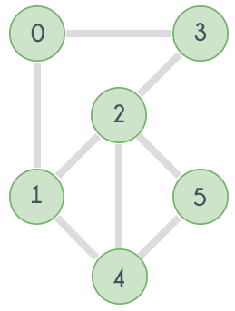

## Strong Connectivity

To reach a target node from a given node, it must be possible to arrive at the target by passing through a finite number of nodes.

In an undirected graph, if every node is reachable from every other node, the graph is called **connected**. When the same concept is applied to directed graphs, it is called **strongly connected**.

In other words, for a directed graph to be **strongly connected**, it must be possible to reach every other node from any given node.

## Biconnectivity

In an undirected graph, if the remaining graph remains connected when any node is removed, the graph is called **biconnected**. In other words, if the graph has no **articulation points**, it is considered a **biconnected** graph.

<figure markdown="span" style="width: 36%">

<figcaption>An example of biconnected graph</figcaption>
</figure>
