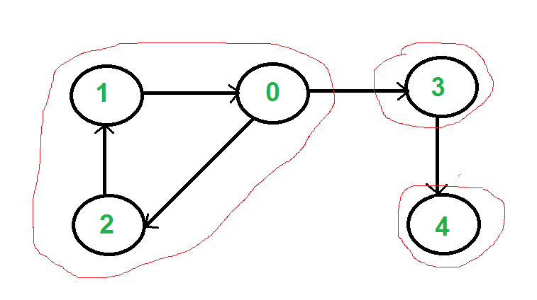
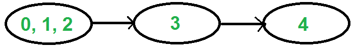

All directed graphs can be divided into disjoint subgraphs that are strongly connected. For two subgraphs to be disjoint, they must not share any common edges or nodes. If we consider each of these resulting subgraphs as a single node and create a new graph, the resulting graph will be a directed acyclic graph (DAG), meaning it will have no cycles.

<figure markdown="span" style="width: 36%">

<figcaption>The subgraphs marked in red are the strongly connected components.</figcaption>
</figure>

<figure markdown="span" style="width: 36%">

<figcaption>The newly formed graph, created by treating each strongly connected component as a single node, results in a directed acyclic graph (DAG), meaning it contains no cycles.</figcaption>
</figure>

Tarjan's Algorithm for finding strongly connected components (SCCs) in a directed graph (An alternative approach is Kosaraju's Algorithm, but Tarjan's algorithm is often preferred in practice due to its speed and simpler understanding):

- Start traversing the graph using DFS order from any node and push the visited nodes onto a stack. Calculate the discovery time for each node. (Discovery time is the time unit when the node is first reached during DFS traversal, and we will call this the index.)
- If a node is in the stack, it is not yet part of any strongly connected component. This is because, when a strongly connected component is found, all the nodes belonging to that component are removed from the stack.
- For each node, calculate the index of the node that has the minimum index among the nodes reachable from the current node and its subtree through edges that do not belong to any strongly connected component. This value is called the "minimum reachable depth" from the subtree of the node (also known as the "low" value).
- If a node's low value is equal to its own index, then this node and all nodes below it in the stack form a strongly connected component. This is because if we call this node "u," there must be an edge from u's subtree back to u itself. Otherwise, u's low value would be clearly smaller than its own index.
- When a strongly connected component is found (as explained in the previous step), remove all nodes belonging to this component from the stack.

Using Tarjan's Algorithm, we can find all strongly connected components in a graph with a time complexity of $\mathcal{O}(V + E)$, where $V$ is the number of vertices and $E$ is the number of edges.

```cpp
void dfs(int node) {
    low[node] = index[node] = ++curTime;
    // curTime holds the discovery time of each node.
    used[node] = true;

    st.push(node);
    inStack[node] = true;
    // inStack holds whether a node is in the stack or not.
    for (auto it : g[node]) {
        if (!used[it]) {
            dfs(it);
            low[node] = min(low[node], low[it]);
        } else if (inStack[it])
            low[node] = min(low[node], index[it]);
        // If the adjacent node is in the stack, then this edge can be a back edge.
    }
    if (low[node] == index[node]) {
        while (1) {
            int x = st.top();
            st.pop();
            cout << x << " ";
            inStack[x] = false;
            if (x == node)
                break;
        }
        cout << endl;
    }
}

void scc() {
    for (int i = 0; i < n; i++)
        if (!used[i])
            dfs(i);
}
```
