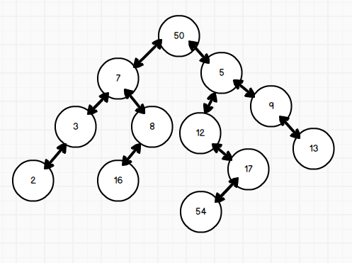

The tree traversal is the process of visiting every node exactly once in a tree structure  for some purposes(like getting information or updating information). In a binary tree there are some described order to travel, these are specific for binary trees but they may be generalized to other trees and even graphs as well.

<figure markdown="span">

<figcaption>a binary tree</figcaption>
</figure>

## Preorder Traversal

Preorder means that a root will be evaluated before its children. In other words the order of evaluation is: Root-Left-Right

```
Preorder Traversal
    Look Data
    Traverse the left node
    Traverse the right node
```

Example: 50 – 7 – 3 – 2 – 8 – 16 – 5 – 12 – 17 – 54 – 9 – 13

## Inorder Traversal
Inorder means that the left child (and all of the left child’s children) will be evaluated before the root and before the right child and its children. Left-Root-Right (by the way, in binary search tree inorder retrieves data in sorted order)

```
Inorder Traversal
    Traverse the left node
    Look Data
    Traverse the right node 
```

Example: 2 – 3 – 7 – 16 – 8 – 50 – 12 – 54 – 17 – 5 – 9 – 13

## Postorder Traversal
Postorder is the opposite of preorder, all children are evaluated before their root: Left-Right-Root

```
Postorder Traversal
    Traverse the left node
    Traverse the right node 
    Look Data
```

Example: 2 – 3 – 16 – 8 – 7 – 54 – 17 – 12 – 13 – 9 – 5 – 50

## Implementation

```py
class Node:
    def __init__(self,key):
        self.left = None
        self.right = None
        self.val = key

def printInorder(root):
    if root:
        printInorder(root.left)
        print(root.val)
        printInorder(root.right)

def printPostorder(root):
    if root:
        printPostorder(root.left)
        printPostorder(root.right)
        print(root.val)

def printPreorder(root):
    if root:
        print(root.val)
        printPreorder(root.left)
        printPreorder(root.right)
```
